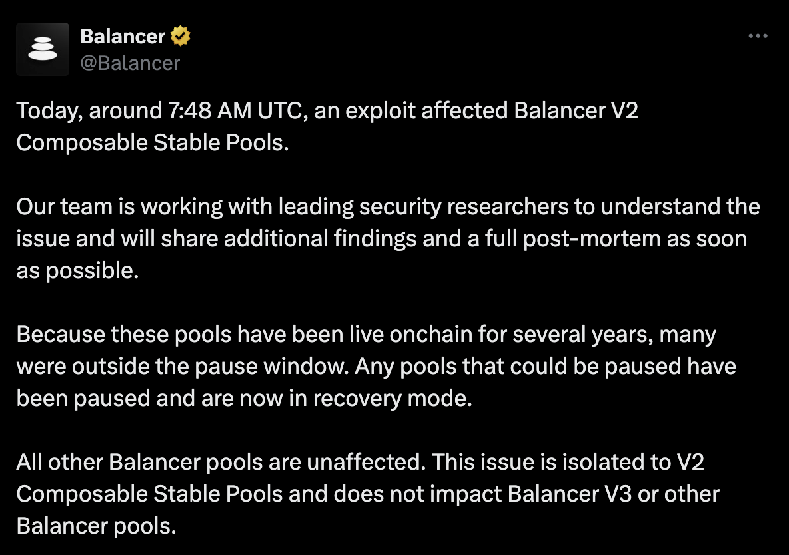
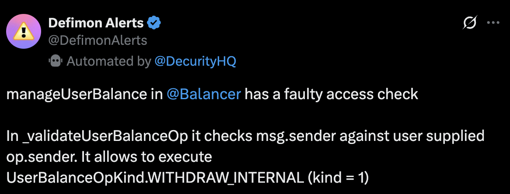
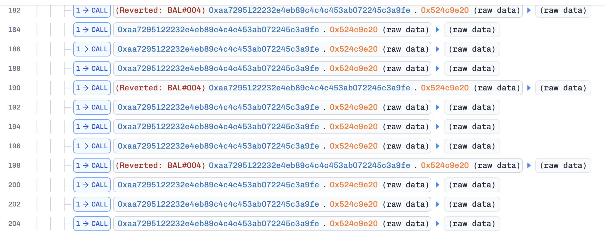
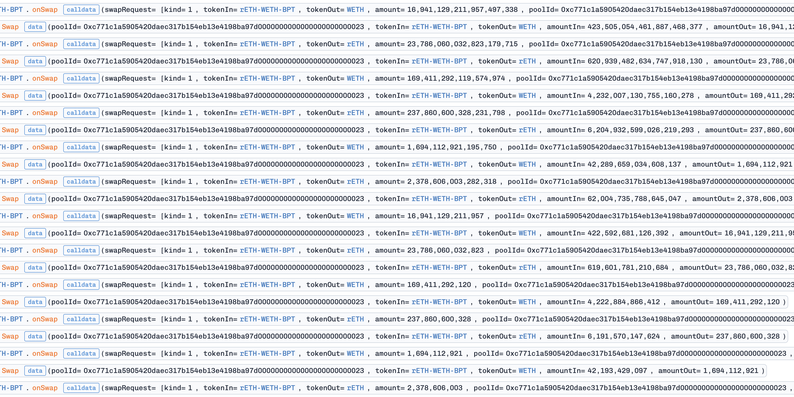
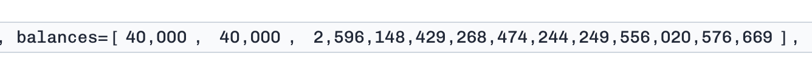
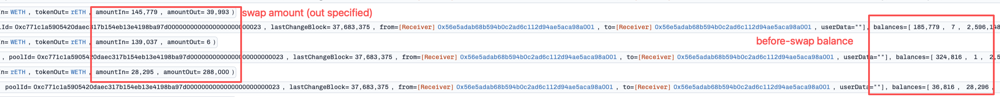
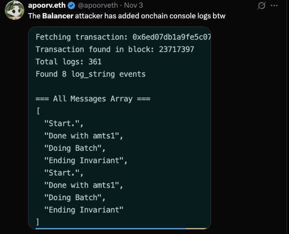
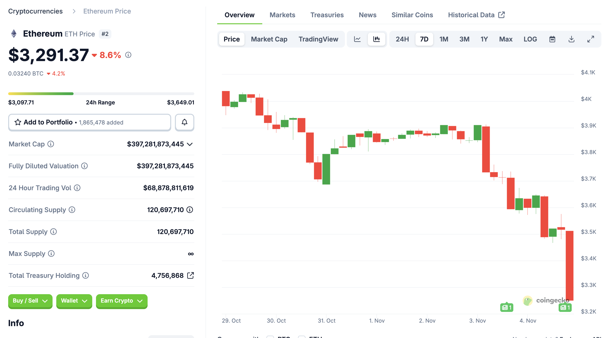

Yesterday on 2025 July 3rd, Balancer was hacked for more than 100 million due to precision loss. While the official post-mortem is not released yet, given that most pools are already [paused or drained](https://x.com/Balancer/status/1985390307245244573), I can now publish my own analysis of the attack. 

In this blog, I will:

- find out the root cause
- analyze the copycats
- how to profit from the incident (not hacking!)

## Attack Analysis

Initially there are several security guys claim that this is merely an access control just like the abracadabra attack (e.g., [DeFimon](https://x.com/DefimonAlerts/status/1985261932220239979), [mywebacy](https://x.com/mywebacy/status/1985767095381213514)).

 However, the transaction they have posted is just the withdraw transaction of the hacker, NOT the attack. For example:

- This is the withdraw transaction: https://basescan.org/tx/0x47c0ecb029135f53301b19a3542709b6d19143684c0ba4e11855be09b34f7747
- This (the contract creation) is the attack transaction: https://basescan.org/tx/0xe9245fb124c3a6ff6a0e39c6d0db02b74b3a3d805f6bf016f4b9ac56cbfb73ae

Balancer has an advanced feature (which is not vulnerable and is a very good feature) that you can use its internal balance management. For example, if you swap eth → dai → usdc, there can be no dai transfer in your transaction whose balance was internally calculated. You can also, at any time, deposit or withdraw your erc20 internal balances, and the withdraw transaction of the hacker is such a transaction.

First question, **why does the hacker split the attack into 2 steps** (attack-then-withdraw)? Despite technical problems, one particular reason might be that this can partially mitigate front-running as the attack transaction is “not profitable” to some of the front runners unless they taken balancers' internal balance into consideration.

---
Now let's dive into the root cause of the attack. The vulnerability is a **PRECISION LOSS** in Balancer's "Composable Stable Pool" implementation, which is a modified version of Curve's stable swap AMM. The Composable Stable Pool on balancer often contains several pegged assets forming a liquidity pool, and these pools' LP token themselves (referred to as BPT) are also a token that can be used to swap inside this pool. Specifically, swapping BPT for token1 equals to withdrawing liquidity and swap token2 to token1.

The AMM curve of the pool is from Curve, but as Curve stable swap only supports 1:1 assets (e.g., USDC & USDT) but not related assets (e.g., wstETH & ETH), Balancer has modified the implementation to support such related assets. The main difference is that Balancer adds a "scaling factor" to each asset to adjust the price according to the peg. For example, if 1 wstETH = 1.05 ETH, then the scaling factor of wstETH is 1.05 while ETH is 1.0, means the pegging target of wstETH is 1.05 ETH. This scaling factor will be set to 105e16 (1.05 * 10^18) in the smart contract, and the code uses the folowing formula to calculate the "scaled amount":
$$scaled\_amount = \frac{raw\_amount * scaling\_factor}{10^{18}}$$

Here comes the precision loss: if raw_amount is very small (e.g., 8 wei), then the above formula can lose its precision by up to 12.5% (1/8) due to integer division.

Another highlight feature is that, due to internal balance calculation, the user can "flash-mint" an arbitrary amount of tokens at the start of the a batch swap call, use them in the pool to swap, and as long as the internal balance is enough at the end of the batch swap. This also contributes to this exploit.

---

Now, let's check into the attack transaction itself. We can take 0xe9245fb124c3a6ff6a0e39c6d0db02b74b3a3d805f6bf016f4b9ac56cbfb73ae on base as an example. On a high level, the attack was split into 4 phases (1 calculation + 3 actions):

### Calculation
The attacker uses a standalone contract to simulate the swap states to trigger the exactly precision loss. This contracts' code is copied from the Balancers' own contracts because it also contains some custom errors in Balancers' code.

### manipulation
The attacker uses "flash-minted" LP token to manipulate the pool state by swapping BPT → token1 and BPT → token2 repeatedly, making the pools' raw balances very small (in the order of 10_000\~100_000). As the flash-minted BPT cannot be withdrawn, the attacker needs to swap them to token1 and token2. After manipulation, as shown in the figure below, the raw balances of token1 and token2 are very small (40,000). This is the first parameter (we can call it $b_{init}$).

### precision-loss
The attacker repeatedly swap between token1 and token2 to trigger the precision loss. Here's a parameter called $small$ which satisfies:
$$\text{try to max}\{(small\ *\ scaling\_factor)\ \%\ 1e18\}$$
This will create the maximum precision loss when swapping $small$ amount of token1 to token2 or vice versa.
Specifically, one iteration contains 3 swaps:

- token1 → token2: swap ($b_{init}$ - $small$ - 1) token1 to token2, this is to create the precision loss condition.
- token1 → token2: swap ($small$) token1 to token2. This will trigger the precision loss.
- token2 → token1: swap around 90% of token2 back to token1 to restore the balance, creating the condition for the next iteration.

  After each iteration, the raw balance of token1 decreases due to precision loss, creating around $\frac{1}{small}$ loss to the lp. The attacker repeated this for multiple times until the profit margin is large enough.

### repay
The attacker finally swaps the remaining token1 and token2 back to BPT to repay the flash-minted LP tokens. This process also needs to be gentle to avoid large price impact. This is part of the withdrawing process as loss is already realized.

### Finally
After all these steps, the attacker finally withdraws all the tokens from the internal balance to his own address. And this withdraw transaction was identified by some security researchers as the "attack" transaction.

## A Speed Run Copycat Game

While the hacker only exploited some of the largest pools on Balancer, there were still food left on the table, extracted by whitehats, copycat attackers, and even some MEV bots. These include:

- some small pools not gained by the main attacker;
- the “dead body” of the bigger pools;
- Balancer forks.

### Front-running
While the attack implementation is complicated, the attacker has put his calculation contract on-chain. On the one hand, this avoids mismatch of state between off-chain calculation and on-chain execution; on the other hand, this also allows others to copy the attack easily. As a result, there are several [front-runners](https://x.com/BitFinding/status/1985377339224871185) who front-run the main attacker to gain some profit.

Funnily, the attacker, while creating this masterpiece hack, does not appear to be a blockchain expert. Two evidences:
- The attacker could have used flashbots or directly submit to builders to avoid front-running, but he did not.
- The attacker left some debugging code (foundry logs) in the execution contract which could have been deleted.

- The hacker took quite a long time (around 20 minutes) to finish all the attacks across ethereum, optimism, arbitrum, polygon, etc.

### Back-running - Copycats
One noting thing is that the attack is too complicated to implement because all the steps need to be precisely calculated to trigger the precision loss. Despite this, [the very first copycat](https://etherscan.io/tx/0x14fb45dd869208edffcb221add152a20292283be172ddb6ccfd2d73e3710b6f4) (by the way, he seems to be a notorious copycat, who also copied the squid bridge attack recently) started exploiting within one hour after the main attack (07:46 UTC -> 08:39 UTC)

How could this be possible? After checking the log of the copycat's transaction, you can find all the logging info from the attacker's contract, meaning the copycat just copied the attacker's contract code and deployed it by himself! So just by replacing the pool address and sender address, the copycat can launch the same attack, with super low effort.

In the following several hours, a large number of copycats appeared, exploiting various pools on Balancer. However, no exceptionally, all the copycats used the same code base as the original attacker, just changing the pool address and sender address.

### Forks
Next the disaster comes to Balancer forks. As Balancer is open source, several forks have been created in the past years, including Beets, BEX, PHUX, etc. According to DeFiLlama's data, there are 27 Balancer V2 forks. (however, only V2 stable pools are vulnerable)

The largest fork, BEX, was also affected and exploited for around $13 million. BEX is the largest DEX on Berachain and has a large number of stable pools. As a result, berachain paused their chain to avoid attackers bridging assets out. Other forks, such as Beets on Sonic & Optimism, also suffered from the same precision loss attack.

It is a sad day in the DeFi history that a single vulnerability affected so many chains and protocols. And ETH prices also dropped, which could be related.

## How to profit (not hacking!)
After I see on Twitter that Balancer was hacked, I was trying to figure out where I can short $BAL token. Unluckily, the only CEX/DEX is Mexc where there is no much liquidity. While I was searching, I realized I could short $BERA because BEX is the largest Balancer fork and it was also affected by the same vulnerability.

Another opportunity is to trade on this Polymarket market: [Another crypto hack over $100m in 2025?](https://polymarket.com/event/major-crypto-exchange-hack-in-2025?tid=1762300995257). It remained a low price within 10 minutes after the attack happened, as reported by Defimon.